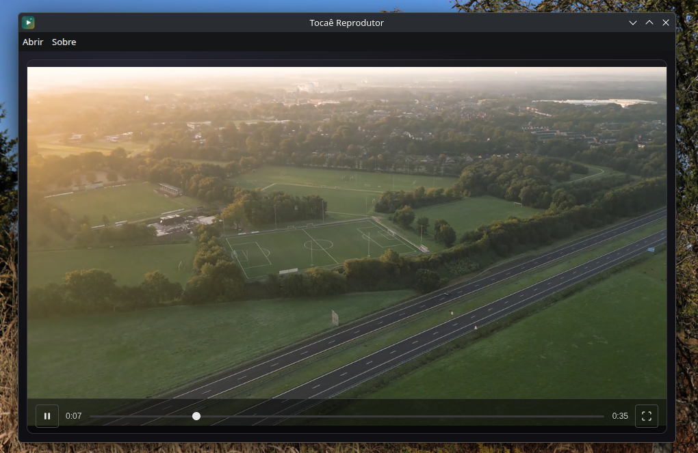

# Tocaê Reprodutor

Reprodutor de vídeo minimalista construído com Electron, React e TypeScript. Abre um vídeo e reproduz sem complicação.

## Autor

Se você gostou deste tema, considere deixar uma ⭐ no repositório!